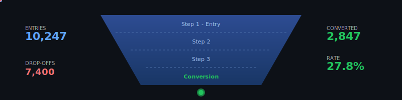
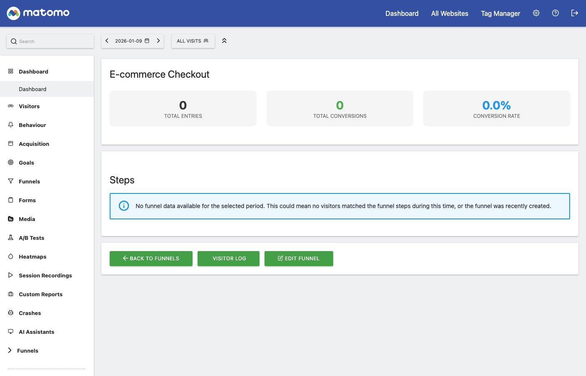
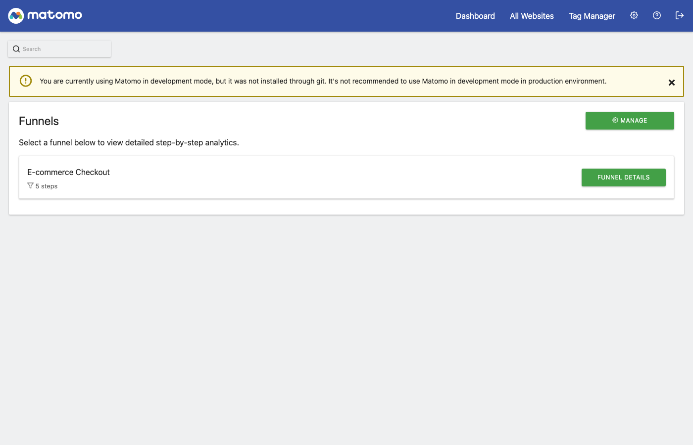
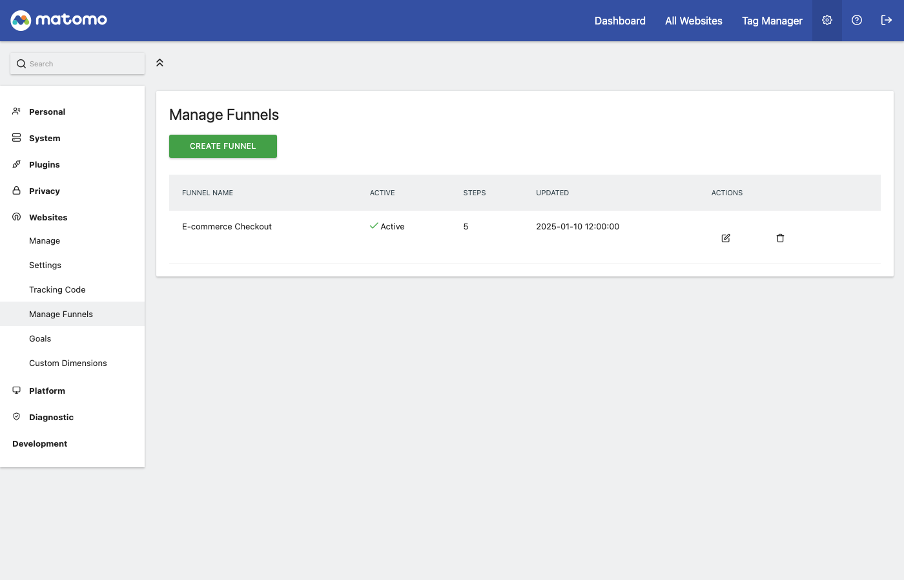
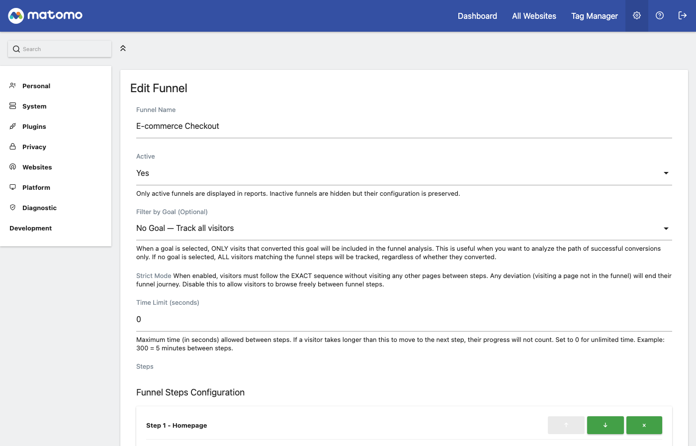

# Matomo Funnels Plugin

<p align="center">
  
</p>

[](https://www.gnu.org/licenses/gpl-3.0)
[](https://php.net/)
[](https://matomo.org/)

A powerful analytics plugin for [Matomo](https://matomo.org/) that enables you to define, track, and analyze visitor paths (funnels) towards conversion goals.

Understand where visitors drop off in your checkout process, signup flow, or any multi-step journey on your website.

> [!TIP]
> **Query your funnels with AI!** Use [MCP Matomo](https://github.com/FGRibreau/mcp-matomo) to ask Claude questions about your funnel data in natural language. _"What's my checkout funnel conversion rate this week?"_ - and get instant answers from your analytics.



---

## Table of Contents

- [Features](#features)
- [Screenshots](#screenshots)
- [Requirements](#requirements)
- [Installation](#installation)
  - [Option 1: Manual Installation](#option-1-manual-installation)
  - [Option 2: Matomo Marketplace](#option-2-matomo-marketplace)
- [Configuration](#configuration)
  - [Creating Your First Funnel](#creating-your-first-funnel)
  - [Step Configuration Options](#step-configuration-options)
- [Usage](#usage)
  - [Viewing Reports](#viewing-reports)
  - [Using Segments](#using-segments)
  - [API Access](#api-access)
- [Development Setup](#development-setup)
  - [Using Docker](#using-docker)
  - [Running Tests](#running-tests)
- [CLI Commands](#cli-commands)
- [Contributing](#contributing)
- [Sponsors](#sponsors)
- [License](#license)
- [Support](#support)

---

## Features

- **Visual Funnel Analysis** - See exactly where visitors drop off in multi-step processes
- **Flexible Step Matching** - Match steps by URL, Page Title, Events, or Search Queries
- **Multiple Comparison Operators** - Equals, Contains, Starts with, Ends with, Regex
- **Goal Integration** - Link funnels to existing Matomo Goals for conversion tracking
- **Standalone Funnels** - Create funnels without requiring a Goal
- **Strict Mode** - Enforce exact path following for accurate analysis
- **Historical Data** - Re-process past data when creating new funnels
- **Segmentation** - Filter visitors who participated in specific funnels
- **Custom Alerts** - Get notified when conversion rates change
- **Privacy-First** - 100% data ownership, GDPR compliant, no external data sharing
- **Performance Optimized** - Reports generated during offline archiving

---

## Screenshots

### Funnel Overview
View all your funnels at a glance with key metrics and sparkline trends.



### Manage Funnels
Create, edit, duplicate, and delete funnels from the management interface.



### Create/Edit Funnel
Define funnel steps with flexible matching options - URL, path, page title, events, or search queries.



### View Funnel Report
Analyze funnel performance with detailed metrics including total entries, conversions, and conversion rates.


---

## Requirements

Before installing, ensure you have:

| Requirement | Version |
|-------------|---------|
| Matomo | 5.0.0 or higher |
| PHP | 7.4 or higher |
| MySQL/MariaDB | 5.7+ / 10.3+ |

> **Note:** This plugin (v3.x) is specifically designed for Matomo 5.x.

---

## Installation

### Option 1: Manual Installation

**Step 1: Download the plugin**

```bash
cd /path/to/your/matomo/plugins
git clone https://github.com/fgribreau/matomo-plugin-funnel.git FunnelInsights
```

> **Note:** The folder name must be `FunnelInsights` (case-sensitive).

**Step 2: Activate the plugin via CLI**

```bash
cd /path/to/your/matomo
./console plugin:activate FunnelInsights
```

**Step 3: Verify installation**

1. Log in to your Matomo dashboard
2. Go to **Administration** (gear icon) → **System** → **Plugins**
3. Confirm "FunnelInsights" appears in the list and is activated

The plugin will automatically create the required database table (`matomo_log_funnel`) during activation.

### Option 2: Matomo Marketplace

1. Log in to your Matomo dashboard as a Super User
2. Go to **Administration** → **Platform** → **Marketplace**
3. Search for "FunnelInsights"
4. Click **Install**
5. Click **Activate**

---

## Configuration

### Creating Your First Funnel

**Step 1: Access the Funnel Manager**

1. Go to your Matomo dashboard
2. Navigate to **Administration** (gear icon)
3. Under your website settings, click **Funnels** → **Manage Funnels**

**Step 2: Create a new funnel**

1. Click **Create New Funnel**
2. Enter a descriptive **Funnel Name** (e.g., "Checkout Process")
3. (Optional) Link to an existing **Goal** for conversion tracking
4. Configure your steps (see below)
5. Click **Save**

**Step 3: Define funnel steps**

Each step represents a page or action in your visitor's journey. Add steps in the order visitors should complete them:

| Step | Example |
|------|---------|
| Step 1 | Cart page (`/cart`) |
| Step 2 | Shipping info (`/checkout/shipping`) |
| Step 3 | Payment (`/checkout/payment`) |
| Step 4 | Confirmation (`/checkout/complete`) |

### Step Configuration Options

Each step supports multiple matching criteria:

| Match Type | Description | Example |
|------------|-------------|---------|
| **URL** | Full page URL | `https://example.com/cart` |
| **Path** | URL path only | `/checkout/shipping` |
| **Page Title** | HTML title tag | `Checkout - Payment` |
| **Event Category** | Matomo event category | `Ecommerce` |
| **Event Action** | Matomo event action | `AddToCart` |
| **Event Name** | Matomo event name | `Product XYZ` |
| **Search Query** | Site search term | `blue shoes` |

**Comparison Operators:**

| Operator | Description |
|----------|-------------|
| `equals` | Exact match |
| `contains` | Substring match |
| `starts_with` | Prefix match |
| `ends_with` | Suffix match |
| `regex` | Regular expression |

**Advanced Options:**

- **Case Sensitive** - Enable for exact case matching
- **Ignore Query Parameters** - Match URLs regardless of query strings
- **OR Logic** - Multiple conditions per step (visitor matches if ANY condition is met)

---

## Usage

### Viewing Reports

Access funnel reports from your Matomo dashboard:

1. Go to **Reports** → **Funnels**
2. Select a funnel from the list

**Available Reports:**

| Report | Description |
|--------|-------------|
| **Funnel Overview** | Visual funnel with drop-off rates at each step |
| **Funnel Evolution** | Conversion trends over time |
| **Step Details** | Detailed metrics per step |

**Key Metrics:**

- **Entries** - Visitors entering the funnel
- **Proceeds** - Visitors continuing to next step
- **Drop-offs** - Visitors leaving the funnel
- **Conversion Rate** - Percentage completing all steps

### Using Segments

Filter your reports by funnel name:

1. Click **Add Segment** in any Matomo report
2. Add condition: `Funnel Name` equals/contains your funnel name

### API Access

Access funnel data programmatically:

```bash
# Get all funnels for a site
curl "https://your-matomo.com/index.php?\
module=API&\
method=FunnelInsights.getFunnels&\
idSite=1&\
format=JSON&\
token_auth=YOUR_TOKEN"
```

**Available API Methods:**

| Method | Description |
|--------|-------------|
| `FunnelInsights.getFunnels` | List all funnels |
| `FunnelInsights.getFunnel` | Get single funnel details |
| `FunnelInsights.getFunnelReport` | Get funnel report data |
| `FunnelInsights.getFunnelEvolution` | Get funnel conversion trends over time |
| `FunnelInsights.getOverview` | Get overview metrics for all funnels |
| `FunnelInsights.getStepEvolution` | Get evolution data for a specific step |
| `FunnelInsights.getSparklineData` | Get sparkline chart data |
| `FunnelInsights.getVisitorLog` | Get visitor log for a funnel |
| `FunnelInsights.getSuggestedValues` | Get suggested values for step configuration |
| `FunnelInsights.createFunnel` | Create a new funnel |
| `FunnelInsights.updateFunnel` | Update existing funnel |
| `FunnelInsights.deleteFunnel` | Delete a funnel |
| `FunnelInsights.duplicateFunnel` | Duplicate a funnel |

---

## Development Setup

### Using Docker

The easiest way to set up a development environment is with Docker.

**Step 1: Clone the repository**

```bash
git clone https://github.com/fgribreau/matomo-plugin-funnel.git
cd matomo-plugin-funnel
```

**Step 2: Start the containers**

```bash
docker-compose up -d
```

**Step 3: Wait for initialization**

```bash
# Wait approximately 30 seconds for Matomo to initialize
docker-compose logs -f matomo
```

**Step 4: Access Matomo**

Open http://localhost:8080 in your browser and complete the Matomo setup wizard.

**Default Docker Configuration (Matomo 5.x):**

| Service | Details |
|---------|---------|
| Matomo | http://localhost:8080 (Matomo 5-fpm-alpine) |
| MariaDB | Port 3306, User: `matomo`, Password: `matomo` (MariaDB 10.6) |
| Database | `matomo` |

**Step 5: Activate the plugin**

```bash
docker-compose exec matomo ./console plugin:activate FunnelInsights
```

### Running Tests

All test scripts are located in the `scripts/` directory.

**Unit Tests:**

```bash
# Install dependencies
composer install

# Run unit tests
./scripts/run-unit-tests.sh

# Or using composer
composer test:unit
```

**Integration Tests:**

```bash
# Requires Docker - starts containers, waits for services, runs tests
./scripts/run-integration-tests.sh

# Or using composer
composer test:integration

# To cleanup containers after tests
CLEANUP_ON_EXIT=true ./scripts/run-integration-tests.sh
```

**Static Analysis (PHPStan):**

```bash
./scripts/run-static-analysis.sh

# Or using composer
composer analyse
```

**E2E Tests (Playwright):**

```bash
cd e2e

# Install dependencies
npm install

# Install browsers
npx playwright install

# Run tests
npm test
```

---

## CLI Commands

The plugin provides CLI commands for administration:

**Re-archive Funnel Data:**

```bash
./console funnels:rearchive --idsite=1 --idfunnel=2
```

This command invalidates and regenerates funnel reports. Use it after:
- Modifying funnel step configuration
- Fixing tracking issues
- Importing historical data

**Options:**

| Option | Description |
|--------|-------------|
| `--idsite` | Site ID (required) |
| `--idfunnel` | Funnel ID (required) |

---

## Contributing

Contributions are welcome! Here's how to get started:

1. **Fork the repository**

2. **Create a feature branch**
   ```bash
   git checkout -b feature/your-feature-name
   ```

3. **Make your changes**

4. **Run tests**
   ```bash
   composer install
   ./vendor/bin/phpunit
   ./vendor/bin/phpstan analyse -c phpstan.neon.dist
   ```

5. **Commit your changes**
   ```bash
   git commit -m "Add: description of your changes"
   ```

6. **Push and create a Pull Request**
   ```bash
   git push origin feature/your-feature-name
   ```

**Coding Standards:**

- Follow [PSR-12](https://www.php-fig.org/psr/psr-12/) coding style
- Write tests for new features
- Update documentation as needed
- Keep commits focused and atomic

---

## Sponsors

<table>
  <tr>
    <td align="center" width="200">
        <a href="https://getnatalia.com/">
        <br/>
        <b>Natalia</b>
        </a><br/>
        <sub>24/7 AI voice and whatsapp agent for customer services</sub>
    </td>
    <td align="center" width="200">
      <a href="https://nobullshitconseil.com/">
        <br/>
        <b>NoBullshitConseil</b>
      </a><br/>
      <sub>360° tech consulting</sub>
    </td>
    <td align="center" width="200">
      <a href="https://www.hook0.com/">
        <br/>
        <b>Hook0</b>
      </a><br/>
      <sub>Open-Source Webhooks-as-a-Service</sub>
    </td>
    <td align="center" width="200">
      <a href="https://france-nuage.fr/">
        <br/>
        <b>France-Nuage</b>
      </a><br/>
      <sub>Sovereign cloud hosting in France</sub>
    </td>
  </tr>
</table>

> **Interested in sponsoring?** [Get in touch](mailto:matomo@fgribreau.com)

---

## License

This project is licensed under the **GNU General Public License v3.0** - see the [LICENSE](LICENSE) file for details.

```
This program is free software: you can redistribute it and/or modify
it under the terms of the GNU General Public License as published by
the Free Software Foundation, either version 3 of the License, or
(at your option) any later version.
```

---

## Support

- **Documentation:** [User Guide](docs/user_guide.md)
- **Issues:** [GitHub Issues](https://github.com/fgribreau/matomo-plugin-funnel/issues)
- **Matomo Forums:** [forum.matomo.org](https://forum.matomo.org/)

---

Made with care for the Matomo community.
